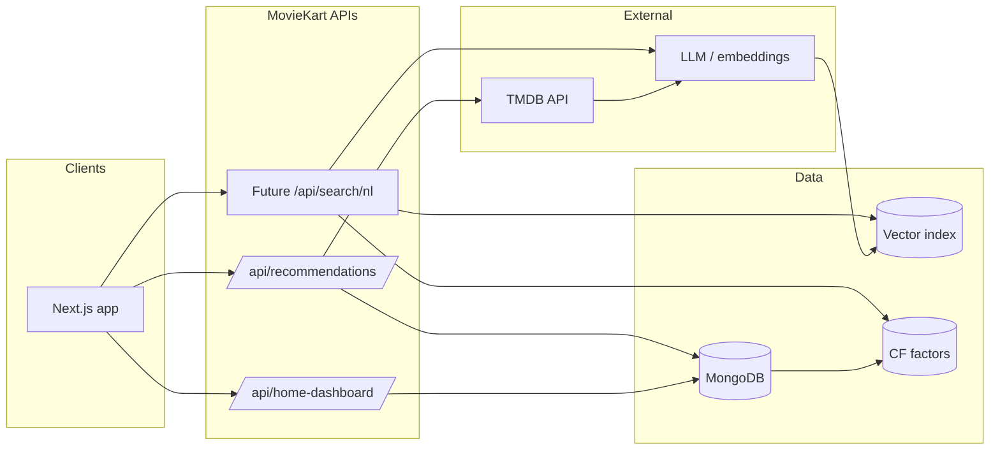

# MovieKart AI-Powered Discovery — Architecture (Expansion Roadmap)

This document describes how today’s MovieKart pieces (behavior signals, TMDB metadata, taste profile, recommendations API) connect to a future **AI discovery layer**, without locking you into a single vendor. Use it as a blueprint for incremental rollout.

## Guiding principles

1. **Separate retrieval from ranking**: cheap filters (genre, year, language) → candidate pool → ML re-ranker.
2. **Version embeddings and models**: store `model_name`, `dim`, `schema_version` beside vectors for safe migrations.
3. **Privacy by default**: embeddings and NL queries should be attributable to a user id; support export/delete.
4. **Observability**: log query id, latency, candidate set size, and downstream engagement (click, watch, hide).

---

## 1. Collaborative filtering (CF)

**Goal**: “Users like you also enjoyed …” using sparse user–item interactions.

| Piece | Today | Next step |
|--------|--------|------------|
| Signals | `watchedMovies`, `Review.rating`, `Collection.movies`, `Activity` | Materialize a nightly **user × movie** matrix or stream updates to a feature store. |
| Algorithm | Hand-tuned blends in `lib/recommendations.js` | **Matrix factorization** (implicit ALS), **BPR**, or hosted CF (e.g. Personalize) reading the same Mongo export. |
| Serving | `/api/recommendations` | Add `/api/recommendations/cf` returning CF scores merged with TMDB metadata. |

**Data flow**: Mongo → batch job (Python/Spark) → user/movie factors stored in Redis or PG → API blends CF score with current TMDB similarity.

---

## 2. Semantic movie similarity

**Goal**: “Movies like *Interstellar* in tone, not just franchise.”

- **Ingest**: TMDB overview + genres + keywords + (optional) Wikipedia plot.
- **Encode**: Sentence-transformer or text-embedding-3 on concatenated text per `movieId`.
- **Store**: Vector DB (pgvector, Qdrant, Pinecone) keyed by `tmdb_id`.
- **Query**: Anchor vector = mean of user’s top-rated watched movies, or explicit anchor title.

**API shape**: `GET /api/similar-movies?movieId=157336&limit=20` → returns ids + `semantic_score`.

---

## 3. Vector-based taste embeddings

**Goal**: One dense vector per user representing “taste in embedding space.”

1. Build **movie vectors** (section 2).
2. User vector = weighted average of movie vectors (weights = rating, recency decay, rewatch flags).
3. Nearest neighbors in movie space → **personalized discovery** beyond co-watched titles.

**Enhancements**: separate vectors for “mood” vs “era” vs “franchise” (multi-vector user profile).

---

## 4. Mood-based recommendations

**Goal**: “Emotional sci-fi like *Interstellar*.”

| Layer | Implementation |
|--------|------------------|
| **Mood tags** | Extend TMDB keywords + LLM classifier on overview → `{ emotional, bleak, hopeful, slow_burn, … }`. |
| **User mood prefs** | Already partially covered by `cinemaStyles` / `reviewBehavior` in `lib/recommendations.js`; map those labels to a fixed mood taxonomy. |
| **Query** | Mood filter + genre filter + vector similarity to anchor movie. |

**Example pipeline**  
NL parse → `genres=[878], moods=[emotional], anchor=Interstellar` → TMDB discover constraints + vector NN + re-rank.

---

## 5. Natural language movie search

**Goal**: Single search box accepts “Recommend emotional sci-fi movies similar to Interstellar.”

1. **Intent router** (small LLM or rules): `discover` | `similar_to_title` | `social` | `faq`.
2. **Entity linking**: resolve “Interstellar” → TMDB id via search API.
3. **Structured query**: `{ genres, moods, anchorId, sort, year_range }` → candidate retrieval (discover + vectors + CF).
4. **Response**: ranked list + short **explanations** (“Because you liked high-concept sci-fi and emotional third acts”).

**Serving**: `POST /api/search/nl` with `{ "q": "..." }` → JSON for UI or streaming text for chat-style UI.

---

## 6. AI-generated movie collections

**Goal**: Curated lists with titles, blurbs, and optional cover art.

- **Input**: User taste vector + optional prompt (“Sunday comfort watches”).
- **Output**: Ordered `movieId[]`, collection name, one-line theme, optional poster collage.
- **Persistence**: Create `Collection` rows with `aiGenerated: true`, `prompt`, `model`, `createdAt` for audit.

**Guardrails**: diversity constraints (max N per franchise), freshness slot, “already watched” suppression (your `excludeIds` pattern).

---

## 7. Suggested system diagram

---

## 8. Phased rollout (practical order)

1. **Phase A**: NL search → structured TMDB discover only (no new infra).
2. **Phase B**: Movie text embeddings + semantic “similar to” in `/api/recommendations`.
3. **Phase C**: User taste vectors + mood taxonomy wired to homepage sections.
4. **Phase D**: CF training pipeline + hybrid re-ranker.
5. **Phase E**: AI collection generation + editorial tools.

---

## 9. Example query mapping

**User:** “Recommend emotional sci-fi movies similar to Interstellar.”

| Step | Output |
|------|--------|
| Entity link | `anchorMovieId = 157336` |
| Genre | Sci-Fi (878) + Drama if emotional bias |
| Mood | `emotional`, `existential` |
| Retrieval | `discover` with genres + keyword filters ∪ vector NN(anchor embedding) ∪ CF neighbors |
| Re-rank | Boost high `vote_average`, penalize seen ids, boost mood match score |
| Explain | Template + optional LLM one-liner |

This keeps **today’s** deterministic behavior as a fallback whenever the AI path is unavailable or low-confidence.
