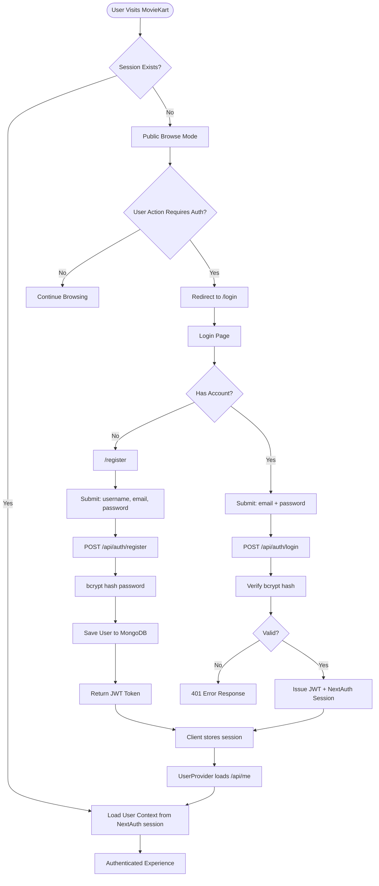
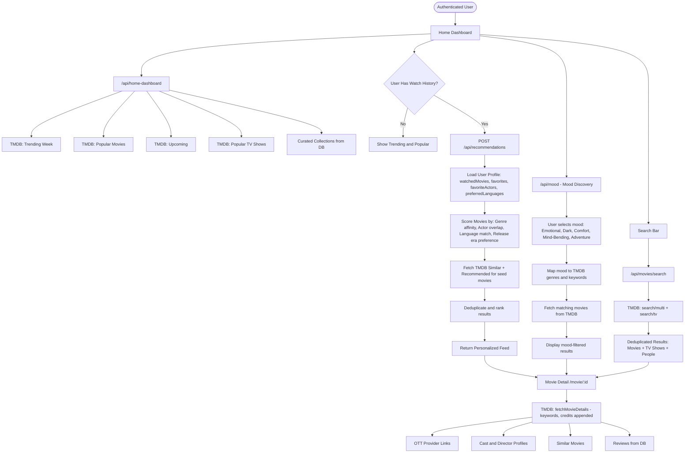
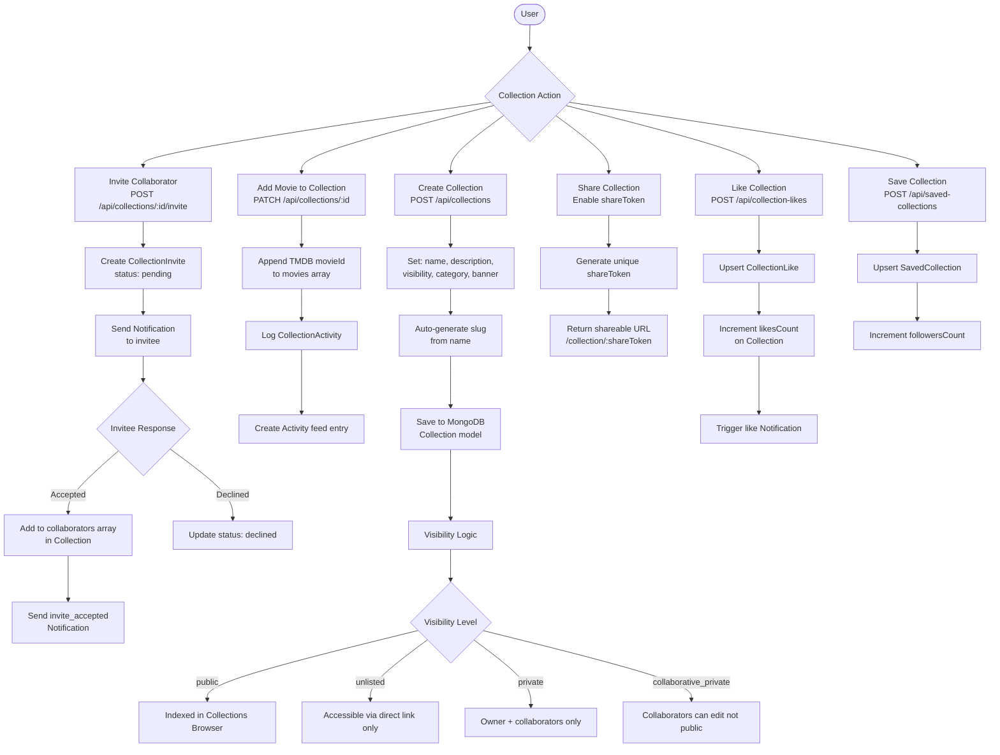
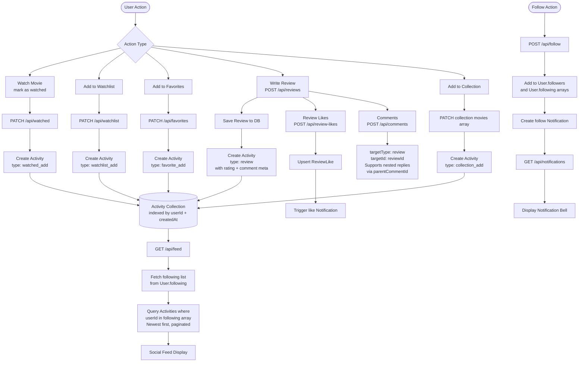
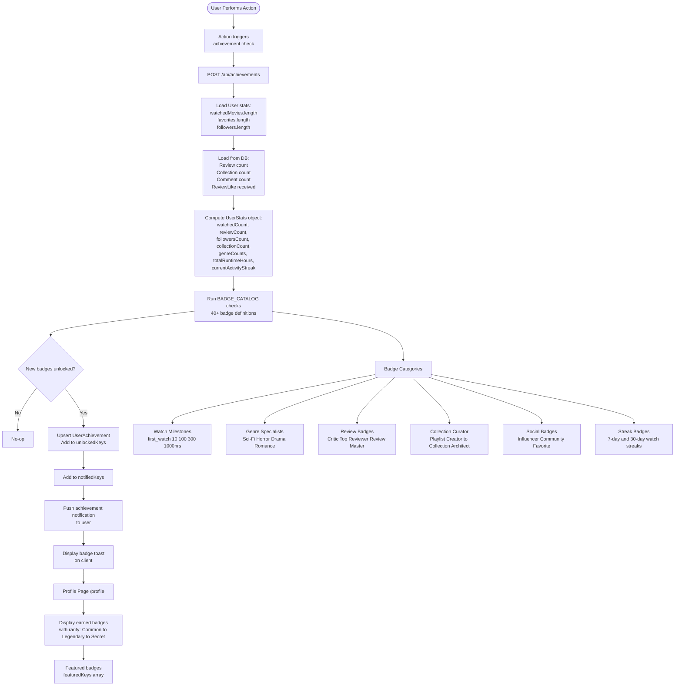
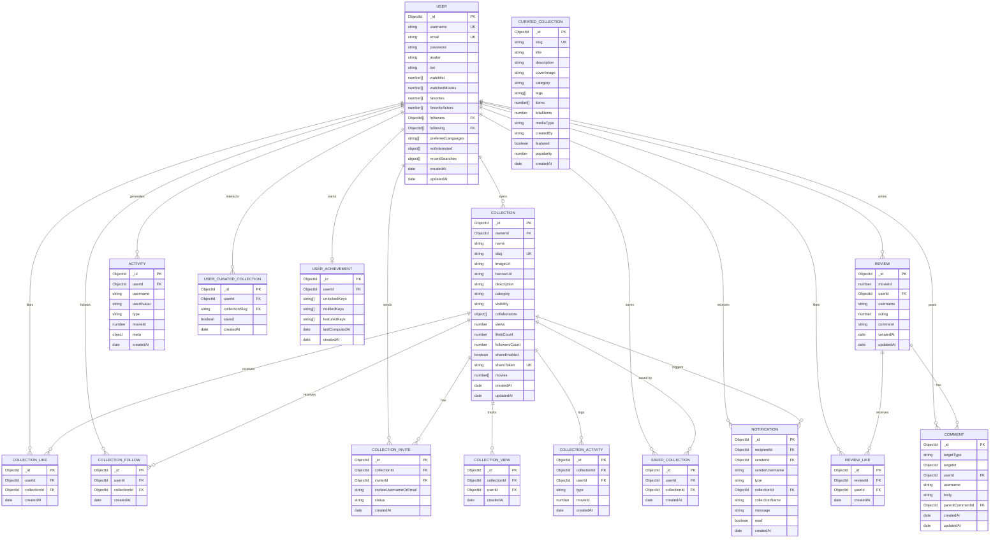

<div align="center">

# 🎬 MovieKart

### *Discover, Track & Share Cinema — Powered by AI*

[](https://nextjs.org/)
[](https://react.dev/)
[](https://mongooseatlas.com/)
[](https://tailwindcss.com/)
[](https://www.themoviedb.org/)
[](https://openai.com/)

> **MovieKart** is a full-stack, AI-powered movie and TV show discovery platform. Explore trending titles, curate personal collections, follow friends, earn achievements, and receive mood-based and personalized recommendations — all in one cinematic experience.

[**Live Demo**](https://moviekart.vercel.app) · [**Report Bug**](https://github.com/Aryansinha123/movieKart/issues) · [**Request Feature**](https://github.com/Aryansinha123/movieKart/issues)

---

</div>

## 📑 Table of Contents

- [Overview](#-overview)
- [Key Features](#-key-features)
- [Tech Stack](#-tech-stack)
- [Project Structure](#-project-structure)
- [Application Flow Diagrams](#-application-flow-diagrams)
  - [User Authentication Flow](#1-user-authentication-flow)
  - [Movie Discovery & Recommendation Flow](#2-movie-discovery--recommendation-flow)
  - [Collection Management Flow](#3-collection-management-flow)
  - [Social & Activity Feed Flow](#4-social--activity-feed-flow)
  - [Achievements & Gamification Flow](#5-achievements--gamification-flow)
- [Database Relationship Schema](#-database-relationship-schema)
- [API Reference](#-api-reference)
- [Environment Variables](#-environment-variables)
- [Getting Started](#-getting-started)
- [SEO Architecture](#-seo-architecture)
- [Deployment](#-deployment)
- [Contributing](#-contributing)
- [License](#-license)
- [Author](#-author)

---

## 🌟 Overview

MovieKart is a production-grade **movie social network** that combines real-time TMDB data with a custom AI recommendation engine. Users can manage their cinematic life — from tracking what they've watched to collaborating on shared movie collections with friends.

The platform is built on **Next.js 16 App Router**, with full **Server Components**, **ISR (Incremental Static Regeneration)**, and a schema-first **MongoDB** backend via Mongoose. It is SEO-optimized with structured JSON-LD data, dynamic sitemaps, and Google Rich Results support.

---

## ✨ Key Features

| Category | Features |
|---|---|
| 🔐 **Auth** | JWT-based register/login, NextAuth sessions, bcrypt password hashing |
| 🎬 **Discovery** | Trending, popular, upcoming movies & TV — powered by TMDB |
| 🤖 **AI Recommendations** | Personalized suggestions from watch history, favorites, genre affinity |
| 🎭 **Mood Discovery** | Natural language mood matching (Emotional, Dark, Mind-Bending, etc.) |
| ⭐ **Taste Profile** | Genre scoring, language preferences, similar user matching |
| 📚 **Collections** | Create, share, collaborate on movie playlists with visibility controls |
| 🧑‍🤝‍🧑 **Social Graph** | Follow users, activity feed, like/comment on collections & reviews |
| 📝 **Reviews** | 1–5 star ratings, rich text reviews, threaded comment system |
| 🏆 **Achievements** | 40+ unlockable badges across 6 categories (watch, review, social, streak…) |
| 📺 **OTT Links** | Deep-link to Netflix, Prime, Disney+, Hotstar, JioCinema, Zee5, and more |
| 🔔 **Notifications** | Real-time alerts for follows, likes, collection invites |
| 🌐 **SEO** | Dynamic metadata, JSON-LD, sitemap.xml, robots.txt, OG images |
| 📱 **PWA** | Web App Manifest, icons, theme color |
| 🎯 **Sports** | Dedicated sports content section |

---

## 🛠 Tech Stack

### Frontend

| Technology | Version | Purpose |
|---|---|---|
| **Next.js** | 16.2.6 | App Router, SSR/SSG/ISR, API Routes |
| **React** | 19.2.4 | UI component library |
| **TailwindCSS** | 4.x | Utility-first styling |
| **Framer Motion** | 12.38.0 | Animations and page transitions |
| **Lucide React** | 1.14.0 | Icon system |
| **Fuse.js** | 7.4.2 | Client-side fuzzy search |
| **React Hot Toast** | 2.6.0 | Toast notification system |
| **Geist Font** | via next/font | Typography (Geist Sans + Geist Mono) |

### Backend

| Technology | Version | Purpose |
|---|---|---|
| **Next.js API Routes** | 16.2.6 | RESTful serverless API layer |
| **MongoDB Atlas** | Cloud | Primary database |
| **Mongoose** | 9.6.2 | ODM — schema definitions and validation |
| **NextAuth.js** | 4.24.14 | Session management and auth providers |
| **JWT (jsonwebtoken)** | 9.0.3 | Stateless authentication tokens |
| **bcryptjs** | 3.0.3 | Password hashing |
| **Axios** | 1.16.0 | HTTP client with retry logic |

### External APIs & AI

| Service | Purpose |
|---|---|
| **TMDB API v3** | Movie/TV metadata, credits, trending, search |
| **OpenAI API** | AI-powered recommendation explanations & NLP mood matching |

### DevOps & SEO

| Tool | Purpose |
|---|---|
| **Vercel** | Deployment platform |
| **ESLint 9** | Code quality |
| **PostCSS** | CSS processing |
| **JSON-LD** | Structured data (Organization, Movie, TVSeries, Review schemas) |
| **Dynamic Sitemap** | Auto-generated XML sitemap for SEO crawlability |
| **robots.js** | Crawl control — allow/disallow rules |

---

## 📁 Project Structure

```
moviekart/
├── app/                        # Next.js App Router
│   ├── layout.js               # Root layout, SEO metadata, providers
│   ├── page.js                 # Homepage
│   ├── [id]/                   # Dynamic route (legacy ID redirect)
│   ├── movie/                  # Movie detail pages
│   ├── auth/                   # Auth pages
│   ├── collection/             # Single collection view
│   ├── collections/            # All collections browser
│   ├── favorites/              # User favorites page
│   ├── feed/                   # Social activity feed
│   ├── login/                  # Login page
│   ├── profile/                # User profile
│   ├── register/               # Registration page
│   ├── settings/               # User settings
│   ├── watched/                # Watched movies list
│   ├── watchlist/              # Watchlist management
│   ├── sitemap.js              # Dynamic XML sitemap
│   ├── robots.js               # Crawl rules
│   └── manifest.js             # PWA manifest
│
├── app/api/                    # RESTful API routes (serverless)
│   ├── auth/                   # Login, register endpoints
│   ├── movies/                 # TMDB movie proxy
│   ├── reviews/                # CRUD reviews
│   ├── comments/                # Threaded comments
│   ├── collections/            # Collection CRUD
│   ├── curated-collections/    # System curated lists
│   ├── collection-likes/       # Like/unlike collections
│   ├── saved-collections/      # Save collections
│   ├── follow/                 # Follow/unfollow users
│   ├── feed/                   # Activity feed
│   ├── favorites/              # Favorites management
│   ├── watchlist/              # Watchlist management
│   ├── watched/                # Watched movies
│   ├── recommendations/        # AI recommendation engine
│   ├── mood/                   # Mood-based discovery
│   ├── taste-profile/          # User taste analytics
│   ├── taste-match/            # Similar user matching
│   ├── achievements/           # Badge computation
│   ├── notifications/          # Notification system
│   ├── review-likes/           # Like/unlike reviews
│   ├── profile/                # Profile data
│   ├── similar-users/          # Discover users with similar taste
│   ├── sports/                 # Sports content
│   ├── hero/                   # Hero carousel data
│   └── home-dashboard/         # Homepage aggregated data
│
├── components/                 # Reusable UI components
│   ├── navbar/                 # Navbar with search
│   ├── home/                   # Hero slider, dashboards
│   ├── movie/                  # Movie cards, detail views
│   ├── collection/             # Collection UI
│   ├── profile/                # Profile components
│   ├── people/                 # Actor/director pages
│   ├── providers/              # React context providers
│   └── ui/                     # Shared UI primitives
│
├── lib/                        # Business logic & utilities
│   ├── tmdb.js                 # TMDB API client (retry + auth)
│   ├── recommendations.js      # Recommendation engine (1018 lines)
│   ├── achievements.js         # Achievement/badge system
│   ├── mood.js                 # Mood-based movie matching
│   ├── ottProviders.js         # OTT deep-link mappings
│   ├── curatedCollections.js   # System curated collection logic
│   ├── homeDashboardData.js    # Homepage data aggregation
│   ├── mongodb.js              # Mongoose connection singleton
│   ├── seo.config.js           # Site-wide SEO constants
│   └── auth.js                 # Auth helpers
│
├── models/                     # Mongoose schemas
│   ├── User.js
│   ├── Collection.js
│   ├── Activity.js
│   ├── Comment.js
│   ├── Review.js
│   ├── ReviewLike.js
│   ├── CollectionLike.js
│   ├── CollectionFollow.js
│   ├── CollectionView.js
│   ├── CollectionActivity.js
│   ├── CollectionInvite.js
│   ├── CuratedCollection.js
│   ├── UserCuratedCollection.js
│   ├── SavedCollection.js
│   ├── Notification.js
│   └── UserAchievement.js
│
├── middleware.js                # Next.js edge middleware
├── next.config.mjs             # Next.js config
├── tailwind.config             # Tailwind config
└── package.json
```

---

## 🔄 Application Flow Diagrams

### 1. User Authentication Flow



---

### 2. Movie Discovery & Recommendation Flow



---

### 3. Collection Management Flow



---

### 4. Social & Activity Feed Flow



---

### 5. Achievements & Gamification Flow



---

## 🗄 Database Relationship Schema



> **Note on TMDB IDs:** All `movieId` fields store TMDB numeric IDs. TV shows use **negative IDs** (`-tmdbId`) to distinguish them from movies while sharing the same number field type. All poster/backdrop image URLs are constructed at runtime using `https://image.tmdb.org/t/p/`.

---

## 📡 API Reference

### Authentication

| Method | Endpoint | Description |
|--------|----------|-------------|
| `POST` | `/api/auth/register` | Register new user |
| `POST` | `/api/auth/login` | Login, returns JWT |
| `GET` | `/api/me` | Get current user session |

### Movies & TV

| Method | Endpoint | Description |
|--------|----------|-------------|
| `GET` | `/api/movies` | Proxy TMDB trending/popular |
| `GET` | `/api/movies/search?q=` | Multi-search movies, TV, people |
| `GET` | `/api/hero` | Hero carousel slides |
| `GET` | `/api/home-dashboard` | Aggregated homepage data |
| `GET` | `/api/recommendations` | Personalized AI recommendations |
| `GET` | `/api/mood?mood=` | Mood-based movie list |
| `GET` | `/api/sports` | Sports content |
| `GET` | `/api/similar-users` | Users with similar taste |
| `GET` | `/api/taste-profile` | User genre/actor analytics |
| `POST` | `/api/taste-match` | Compute taste similarity score |

### User Library

| Method | Endpoint | Description |
|--------|----------|-------------|
| `GET/PATCH` | `/api/watchlist` | Get/update watchlist |
| `GET/PATCH` | `/api/watched` | Get/update watched movies |
| `GET/PATCH` | `/api/favorites` | Get/update favorites |
| `POST/DELETE` | `/api/follow` | Follow/unfollow users |

### Reviews & Comments

| Method | Endpoint | Description |
|--------|----------|-------------|
| `GET/POST/PATCH/DELETE` | `/api/reviews` | Review CRUD |
| `POST/DELETE` | `/api/review-likes` | Like/unlike reviews |
| `GET/POST/DELETE` | `/api/comments` | Threaded comments |

### Collections

| Method | Endpoint | Description |
|--------|----------|-------------|
| `GET/POST` | `/api/collections` | List / create collections |
| `GET/PATCH/DELETE` | `/api/collections/:id` | Single collection CRUD |
| `POST` | `/api/collections/:id/invite` | Invite collaborator |
| `POST/DELETE` | `/api/collection-likes` | Like/unlike collection |
| `POST/DELETE` | `/api/saved-collections` | Save/unsave collection |
| `GET` | `/api/curated-collections` | System curated lists |

### Social & Notifications

| Method | Endpoint | Description |
|--------|----------|-------------|
| `GET` | `/api/feed` | Activity feed from followed users |
| `GET/PATCH` | `/api/notifications` | Get / mark-read notifications |
| `GET` | `/api/achievements` | Compute and retrieve badges |
| `GET` | `/api/profile/:username` | Public user profile |
| `GET` | `/api/users` | User search |

---

## 🔐 Environment Variables

Create a `.env.local` file in the project root:

```env
# MongoDB Atlas
MONGODB_URI=mongodb+srv://<user>:<password>@cluster.mongodb.net/moviekart

# TMDB API — supports both v3 API key and v4 Bearer token
TMDB_API_KEY=your_tmdb_api_key_or_bearer_token

# NextAuth
NEXTAUTH_SECRET=your_nextauth_secret
NEXTAUTH_URL=http://localhost:3000

# JWT
JWT_SECRET=your_jwt_secret

# OpenAI (for AI recommendations)
OPENAI_API_KEY=your_openai_api_key

# Site URL (used for SEO canonical and OG URLs)
NEXT_PUBLIC_SITE_URL=https://moviekart.vercel.app
```

> **TMDB Key Detection:** The TMDB client auto-detects whether you are using a v3 API key (short string, appended as query param) or a v4 Bearer token (JWT-like, sent as Authorization header).

---

## 🚀 Getting Started

### Prerequisites

- Node.js **18+**
- MongoDB Atlas account (or local MongoDB)
- TMDB API account — [get a key](https://www.themoviedb.org/settings/api)
- OpenAI API account (optional, for AI features)

### Installation

```bash
# 1. Clone the repository
git clone https://github.com/Aryansinha123/movieKart.git
cd moviekart

# 2. Install dependencies
npm install

# 3. Set up environment variables
cp .env.example .env.local
# Edit .env.local with your keys

# 4. Run the development server
npm run dev
```

Open [http://localhost:3000](http://localhost:3000) in your browser.

### Build for Production

```bash
npm run build
npm run start
```

---

## 🌐 SEO Architecture

MovieKart implements enterprise-grade SEO across all pages:

| SEO Feature | Implementation |
|---|---|
| **Dynamic Metadata** | `generateMetadata()` on every page |
| **JSON-LD Schemas** | Organization, WebSite, Movie, TVSeries, AggregateRating, BreadcrumbList |
| **XML Sitemap** | Auto-generated via `app/sitemap.js` — includes trending, popular, collections |
| **robots.txt** | Serves via `app/robots.js` — disallows API, auth, profile pages |
| **OpenGraph** | Dynamic OG images with movie poster, title, rating |
| **Twitter Cards** | `summary_large_image` for all movie pages |
| **Canonical URLs** | Every page declares `<link rel="canonical">` |
| **PWA Manifest** | `app/manifest.js` — icons, theme color, display mode |
| **ISR** | Movie pages revalidate every 24h |
| **Slug URLs** | SEO-friendly `/movie/interstellar-2014` instead of `/movie/603` |
| **SearchAction** | Schema.org `SearchAction` for Google Sitelinks Search Box |

---

## 📦 Deployment

### Vercel (Recommended)

1. Push your code to GitHub
2. Import the project on [vercel.com](https://vercel.com)
3. Add all environment variables in the Vercel dashboard under **Settings → Environment Variables**
4. Deploy — Vercel auto-detects Next.js and configures everything

```bash
# Or deploy via Vercel CLI
npx vercel --prod
```

---

## 🤝 Contributing

Contributions are welcome! Please follow these steps:

1. Fork the repository
2. Create a feature branch: `git checkout -b feature/your-feature-name`
3. Commit your changes: `git commit -m 'feat: add some feature'`
4. Push to the branch: `git push origin feature/your-feature-name`
5. Open a Pull Request

### Pending Features (Good First Issues)

- [ ] Group watchlists / shared watch parties
- [ ] Email digests for weekly recommendations
- [ ] Improved AI explanation prompts for recommendations
- [ ] Pagination and infinite scroll for the collections browser
- [ ] Localization / multi-language UI support
- [ ] Rate limiting on public API routes
- [ ] Admin moderation tools for reviews/comments
- [ ] End-to-end testing setup

---

## 📄 License

This project is licensed under the **MIT License**.

---

## 👤 Author

**Aryan Sinha**

[](https://github.com/Aryansinha123)

---

<div align="center">

**MovieKart** — Built with love and coffee by Aryan Sinha

*This product uses the TMDB API but is not endorsed or certified by TMDB.*

</div>